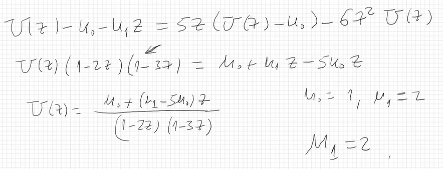
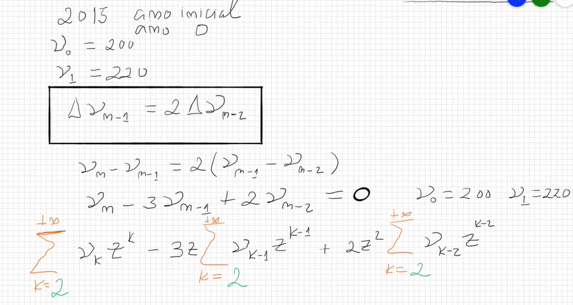
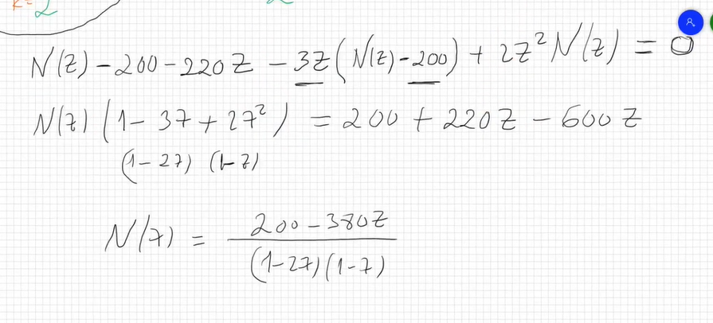
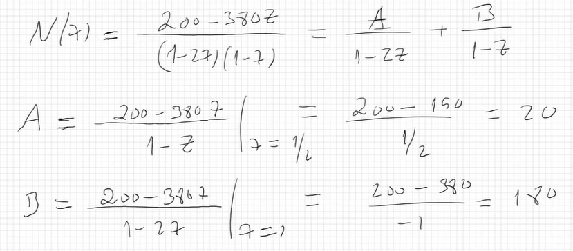

# Equações de diferenças finitas

## Problema da Torre de Hanói

Chamemos a $h_n$ a função que nos diz o número de movimentos necessários para transportar $n$ discos de uma torre para outra.

$$
h_0=0\\
h_n=2h_{n-1}+1
$$

A que se chama uma equação às diferenças finitas. Os coeficientes que multiplicam os termos da sucessão são números — não são dependentes de $n$. Diz-se então uma equação linear. Nós queremos usar o método das funções geradoras para aprender a resolver equações lineares (escrevemos termos da sucessão à custa de outros termos).

## Passos

$$h_k\quad= 2\qquad h_{k-1}\quad+1\rightarrow \color{red}{\sum_{k=1}^{+\infty}\color{black}h_k\color{red}z^k}\color{black}=2\color{red}z{\sum_{k=1}^{+\infty}\color{black}h_{k-1}\color{red}z^{k-1}}\color{black}+\color{red}{\sum_{k=1}^{+\infty}\color{black}\color{red}z^k}\color{black}$$

Note-se que o índice dos somatórios deve ser o menor inteiro para o qual a expressão faz sentido (1, neste caso). Também se deve ter a potência de $z$ coincidente com a ordem da sucessão (valor para $n$). Note-se que para o último somatório:

$$\sum_{k=1}^{+\infty}z^k=\frac{1}{1-z}\textcolor{red}{-1}=\frac z {1-z}$$

onde o assinalado a vermelho vem devido ao índice do nosso somatório ($z^0=1$).

Agora, para o somatório do meio:

$$z\sum_{k=1}^{+\infty}h_{k-1}z^{k-1}=z\sum_{j=0}^{\infty}h_jz^j=zH(z)$$

onde $H$ é a função geradora de $h_n$.

logo, finalmente, vem:

$$
h_n=2h_{n-1}+1\quad\Leftrightarrow \quad H_n=2zH_n+\frac{z}{1-z}\\
\longrightarrow H_n=\frac{z}{(1-z)(1-2z)}
$$

Com a fórmula nesta escrita, não conseguimos concluir nada acerca da sucessão $h_n$. Para isso, decompõe-se as frações com o **método de Hermite**, ou _cover-up method_:

$$\frac{z}{(1-z)(1-2z)}=\frac {\Alpha}{1-z}+ \frac{\Beta}{1-2z}$$

Para descobrir o coeficiente $\Alpha$, _tapa-se_ o respetivo denominador na fração inicial e avalia-se a expressão resultante no zero desse denominador, do seguinte modo:

$$\Alpha=\left|\frac z{1-2z}\right|_{z=1}=\frac 1 {1-2}=-1$$

$$\Beta=\left|\frac z{1-z}\right|_{z=\frac 1 2}=\frac {\frac 1 2} {1-\frac 1 2}=1$$

logo:

$$\frac{z}{(1-z)(1-2z)}=\frac {-1}{1-z}+ \frac{1}{1-2z}$$

donde se tira a conclusão que:

$$H_n=\frac {-1}{1-z}+ \frac{1}{1-2z}\longrightarrow h_n= -1 + 2^n$$

Abaixo segue outro exemplo de raciocínio análogo, à exceção de que nos dão os dois primeiros termos da sucessão $u_n$:

E se não nos dessem os primeiros termos?

### Exemplo 1 - Aumento populacional

