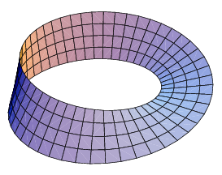

# Fluxo. Teorema da Divergência

[[toc]]

## Superfície Orientável

::: tip DEFINIÇÃO

Seja a superfície $S \subset \R^3$. Diz-se que $S$ é orientável se existir $\vec n: S \to \R^3$ com

- $\forall x \in S$, $\quad \vec n (x) \in T_x S$, isto é, o vetor é perpendicular à superfície
- $|| \vec n (x) || = 1, \forall x$
- $\vec n$ é contínuo

:::

Como exemplo de uma superfície {red}(**não orientável**) temos a [Fita de Möbius](https://en.wikipedia.org/wiki/M%C3%B6bius_strip):

Também podemos ver um exemplo de uma superfície {green}(**orientável**):

[imagem]

**Teoremas:**

- Uma superfície descrita por uma por uma parametrização é **sempre** orientável.
- Uma superfície orientável tem sempre dois campos normais.

::: details Demonstração

Seja $g: \underset{(u,v)}{D} \to S$ uma parametrização, então

- $T_x S = \mathcal{L} \{ \text{colunas de}\ Dg \} = \mathcal{L} \left\{ \frac{\partial g}{\partial u} , \frac{\partial g}{\partial v} \right\}$
- $\frac{\partial g}{\partial u} \times \frac{\partial g}{\partial v}$ é ortogonal a $\frac{\partial g}{\partial u} \text{e} \frac{\partial g}{\partial v} \implies \frac{\partial g}{\partial u} \times \frac{\partial g}{\partial v} \in (T_x S)^{\perp}$

Logo, $\displaystyle \vec n (x) = \frac{\frac{\partial g}{\partial u} \times \frac{\partial g}{\partial v}}{|| \frac{\partial g}{\partial u} \times \frac{\partial g}{\partial v} ||}$ tem norma $1$ e safisfaz as condições do campo da superfície orientável.

:::

## Fluxo

::: tip DEFINIÇÃO

Seja o campo vetorial $F: \R^3 \to \R^3$, e a superfície orientável $S$, com orientação $\vec n$.

Definimos o fluxo de $F$ através de $S$ como

$$
\int_S F \cdot \vec n = \int_S F(x,y,z) \cdot \vec n (x,y,z)
$$

:::

Também se pode continuar a trabalhar a definição acima, para chegar a uma nova expressão para o fluxo:

$$
\begin{aligned}
\int_S F \cdot \vec n &= \iint_D F(g(u,v)) \cdot \frac{\frac{\partial g}{\partial u} \times \frac{\partial g}{\partial v}}{||\frac{\partial g}{\partial u} \times \frac{\partial g}{\partial v}||}
\cdot ||\frac{\partial g}{\partial u} \times \frac{\partial g}{\partial v}|| \d u \d v\\
&= \iint_D F(g(u,v)) \cdot \left(\frac{\partial g}{\partial u} \times \frac{\partial g}{\partial v}\right) \d u \d v
\end{aligned}
$$

::: details Exemplo

**Sejam o campo vetorial $F$ e a superfície $S$**

$$
\begin{array}{ll}
F(x,y,z) = (x,y,z) &
S= \{x^2+y^2+z^2 = 1, z > 0 \}
\end{array}
$$

**com orientação tal que, no ponto $(0,1,0)$, a segunda componente de $\vec n$ seja positiva.**

**Qual o fluxo de $F$ através de $S$?**

[imagem]

Começamos por representar $S$ através de uma parametrização, em que usamos coordenadas esféricas:

$$
\begin{aligned}
g(u, v) &= (\sin v \cos u, \sin u \sin v, \cos v)\\
&u \in ]0,2\pi[, v \in ]0, \frac{\pi}{2}[
\end{aligned}
$$

$$
\begin{aligned}
\frac{\partial g}{\partial u} &= (-\sin u \sin v, \cos u \sin v, 0)\\
\frac{\partial g}{\partial v} &= (\cos v \cos u, \cos v \sin u, -\sin v)
\end{aligned}
$$

De seguida calculamos o produto interno entre $\frac{\partial g}{\partial u}$ e $\frac{\partial g}{\partial v}$:

$$
\begin{aligned}
\frac{\partial g}{\partial u} \times \frac{\partial g}{\partial v} &= \begin{vmatrix}
e_1 & e_2 & e_3 \\
-\sin u \sin v & \cos u \sin v & 0\\
\cos v \cos u & \cos v \sin u & - \sin v
\end{vmatrix}\\
&= (-\cos u \sin^2 v, - \sin u \sin^2 v, - \sin^2 u \sin v \cos v - \cos^2 u \sin v \cos v)\\
&= (-\cos u \sin^2 v, - \sin u \sin^2 v, - \sin v \cos v)
\end{aligned}
$$

Temos de verificar agora se a orientação do campo é a correta.  
Tomamos o ponto $(0,1,0)$, isto é, $u = \frac{\pi}{2}$ e $v = \frac{\pi}{2}$, e vemos que
$-\sin u \sin^2 v = -1 < 0$, logo a orientação é {red}(errada).

$$
F(g(u,v)) = (\sin v \cos u, \sin u \sin v, \cos v)
$$

$$
\begin{aligned}
F(g(u,v)) \cdot \left(\frac{\partial g}{\partial u} \times \frac{\partial g}{\partial v}\right)
&= - \cos^2 u \sin^3 v - \sin^2 u \sin^3 v - \sin v \cos^2 v\\
&= - \sin^3 v - \sin v \cos^2 v\\
&= - \sin v
\end{aligned}
$$

Assim, como a orientação está incorreta:

$$
\begin{aligned}
\text{fluxo} &= - \int^{2\pi}_0 \int^{\frac{\pi}{2}}_0 (- \sin v) \d v \d u\\
&= - \int^{2 \pi}_0 [\cos v]^{\frac{\pi}{2}}_0 \d u\\
&= - \int^{2\pi}_0 - 1 \d u\\
&= 2\pi
\end{aligned}
$$

{orange}(**Alternativamente, podíamos ter usado a outra expressão para o fluxo, em que chegávamos a cálculos bastante mais simples:**)

Conseguimos "adivinhar" que o vetor normal é descrito por $\vec m (x,y,z) = (x,y,z)$, tal como pode ser evidenciado pela figura abaixo:

[imagem]

De seguida, é só calcular o fluxo:

$$
F \cdot \vec m = (x,y,z) \cdot (x,y,z) = x^2+ y^2+ z^2 = 1
$$

Sabemos que a expressão acima é 1 visto que é uma (semi) esfera.

$$
\text{fluxo} = \int_S F \cdot \vec m = \int_S 1 \d S = \text{área}(S) = 2 \pi
$$

:::

---

Slides:

- [Aula 45](https://drive.google.com/file/d/1PUIi-kVyklWydOd2nsVZF4xCUKXIVM_V/view?usp=sharing)
