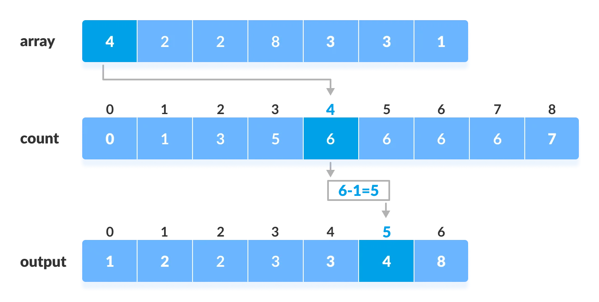

# Algoritmos Elementares de Ordenação (Continuação)

[[toc]]

## Counting Sort

### Explicação

Este algoritmo permite de forma rápida uma lista de números que sejam muito repitidos.

Conta para uma lista o número de ocorrências de cada número. ( conta primeiro os 0's, depois os 1's,...)

E depois colocar na lista os elemntos de acordo com os valores da lista.

### Código

<<< @/src/iaed/assets/0011-count.c

- Complexidade: O(N + M)

- É estável

- Não é in-place

## Radix Sort

### Explicação

- Baseia-se na estrutura dos elementos a ordenar.
- Ordena elementos processando cada digito/bit/carácter
  separadamente, usando e.g. o Counting Sort

- Aplicável a chaves de dimensão fixa

- Funciona porque o Counting Sort é estável

  - Preserva as ordenações das iterações anteriores

- Complexidade: O(NM)

### RADIX LSD

Aplica o Counting Sort sucessivamente dos dígitos menos
significativos (Less Significant Digits) para os dígitos mais
significativos.

<<< @/src/iaed/assets/0011-radix.c

### RADIX MSD

Aplica o counting Sort sucessivamente
começando pelos dígitos mais significativos
(Most Significant Digits).

<<< @/src/iaed/assets/0011-msd.c

Tal como na última aula aconselho vivamente a ver os exemplos da aula.

- [Demonstração visual dos algoritmos](https://gonque.github.io/sorting-algos/)

Slides:

- [Aula 11](https://drive.google.com/file/d/1hyn_bZjbht2hgVXXRFCXpJfPMbsNAlsb/view?usp=sharing)
