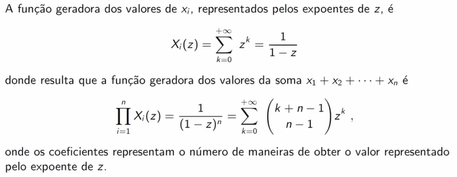

# Teoremas e cálculo combinatório

## Teoremas sobre cálculo combinatório e funções geradoras

### Teorema 1

$$
\text{Para todo o } n, m \in \N \text{ tem-se:}
\sum_{k=0}^{m} {k+m \choose m} = {n+m+1 \choose m+1}$$

Demonstração:

$$\text{\textbf{Base da indução:}}\quad n \leftarrow0 \\

\sum_{k=0}^{0}{k+m \choose m} = {0+m \choose m} = {m+1 \choose m+1} = 1
\\
\text{\textbf{Hip. Ind.}}: \sum_{k=0}^{n} {k+m \choose m} = {n+m+1 \choose m+1}\\

\text{\textbf{Passo de indução}}\quad n+1 \leftarrow n\\ 

\sum_{k=0}^{n+1} {k+m \choose m} = \sum_{k=0}^{n} {k+m \choose m}
+{n+1+m \choose m}=\\
 ={n+1+m \choose m+1}+{n+1+m \choose m} = {n+2+m \choose m+1}$$

### Teorema 2

$$\text{Se U é a função geradora da sucessão } u_n\text{, então a função geradora da sucessão}\\ s_n=\sum_{i=0}^{n}u_i\qquad \text{ (somas parciais de }u_n)\\
\text{é:}\\
S(z)=\frac{U(z)}{1-z}$$

Demonstração:

### Teorema 3

$$\text{Para todo o }m \in \N_1,\\
\frac{1}{(1-z)^m}=\sum_{k=0}^{+\infty} {k+m-1 \choose m-1}z^k$$

Demonstração:

$$\text{\textbf{Base da indução:}}\quad n \leftarrow0 \\
\frac{1}{(1-z)^1}=\frac 1 {1-z} = \sum_{k=0}^{+\infty}{k+1-1 \choose 1-1}z^k = \sum_{k=0}^{+\infty}z^k\\
\text{\textbf{Hip. Ind.: }}\frac{1}{(1-z)^m}=\sum_{k=0}^{+\infty} {k+m-1 \choose m-1}z^k\\

\text{\textbf{Passo de indução}}\quad m+1 \leftarrow m\\ 
\frac 1 {(1-z)^{m+1}}=\frac 1 {1-z}\times \frac 1 {(1-z)^m}=\\
= \frac 1 {1-z} \times \sum_{k=0}^{+\infty} {k+m-1 \choose m-1}z^k\qquad(u_k)\\

\sum_{k=0}^{+\infty}\left(
\sum_{i=0}^k{i+m-1 \choose m-1}\right)z^k =\\
= \sum_{k=0}^{+\infty}{k+m \choose m}z^k$$

exemplos de aplicação:

$$\frac{1}{(1-z)^2} =\sum_{k=0}^{+\infty}{k+2-1 \choose 2-1}z^k=\sum_{k=0}^{+\infty}(k+1)z^k= n+1$$

e generalizando:

$$\frac 1 {(1-\lambda z)^m} = \sum_{k=0}^{+\infty} \left[{k+m-1 \choose m-1}\lambda^k\right]z^k \text{ onde} \\
u_n={n+m-1 \choose m-1}y^n$$

## Problemas de contagem

Seja $n \in \N_1$ e $l \in \N.$  O número de soluções inteiras não negativas da equação:

$$x_1+x_2+x_3+x_4+\dots+x_n=l$$

 é dado pela expressão:

$${l+n-1 \choose n-1}$$

Demonstração:

Exemplos:

