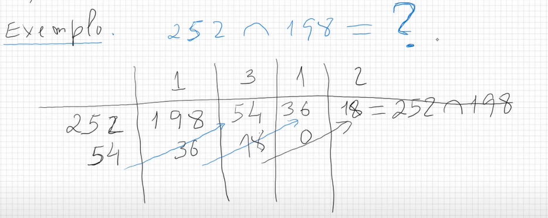

# Máximo divisor comum

## Máximo divisor comum

**Definição:** dados dois números $a$ e $b$ inteiros, diz-se que o número $d \in \N_1$ é máximo divisor comum de $a$ e $b$, e escreve-se $a \frown b$, se:

a) $d | a$ ($d$ divide $a$) e $d|b$;

b) Para todo o $d' \in \N_1$ tal que $d'|a$ e $d'|b$ tem-se que $d'|d$.

Tem-se a seguinte propriedade:

$$a \frown b = (-a) \frown b =a \frown (-b) = (-a)\frown(-b)$$

### Teorema da unicidade:

Se existir o máximo divisor de $a$ e de $b$, então este é único.

### Prova:

$d$ é M.D.C. de $a$ e $b$. Vem então:

a) $d|a$ e $d|b$;

b) $\forall_{d'' \in \N_1}((d''|a$ e $d''|b) \implies d''|d$

Suponha-se a existência de $d'$ e que este também é M.D.C. de $a$ e $b$. Então:

c) $d'|a$ e $d'|b$;

d) $\forall_{d'' \in \N_1}((d''|a$ e $d''|b) \implies d''|d'$

A partir das proposições a) e d) retira-se que $d|d'$. A partir das proposições c) e b) retira-se que $d'|d$. Assim, pela _antissimetria da divisão_, vem que $d=d'$.

### Teorema da base da recorrência:

Se o inteiro $a$ divide o inteiro $b$, então $a \frown b = a$.

### Prova:

Como se tem que $a|a$ e $a|b$, tem-se pela proposição vista no início que $a \frown b = a$.

### Teorema do resto da divisão:

Se $r_1$ é o resto da divisão de $a$ por $b$, então $a\frown b$ existe e coincide com $b \frown r_1$.

### Prova:

Tem-se $a = bq_1 + r_1$ onde $q_1$ é o quociente entre $a$ e $b$ e $r_1$ o resto da sua divisão inteira.

1. Repare-se que se $d|a$ e $d|b$, então $d|r_1$:

$$a = bq_1+r_1 \Leftrightarrow dk=dk'q_1+r_1 \Leftrightarrow r_1=d(k-k'q_1)$$

2. Por um raciocínio análogo, se $d|b$ e $d|r_1$, então $d|a$.

A partir destas duas proposições, vem:

$$
1\implies \text{divisores(}a,b)\subseteq \text{divisores(}b,r_1);
\\
2\implies
\text{divisores(}b, r_1)\subseteq \text{divisores(}a, b);
$$

E a proposição inicial está provada.

### Algoritmo de Euclides

Se $a$ e $b$ são inteiros não simultaneamente nulos, então existe $a \frown b$.

### Prova:

Tome-se $b = r_0$.

Vem:

$$
a = r_0q_1+r_1 \qquad r_1 < r_0 \\
r_0=r_1q_2+r_2 \qquad r_2 < r_1 \\

r_1=r_2q_3+r_3 \qquad r_3 < r_2 \\

r_2=r_3q_4+r_4 \qquad r_4 < r_3 \\
\vdots\\
r_n=r_{n-1}q_n+r_n \qquad r_n < r_{n-1} \\
$$

Onde $r_n<r_{n-1}<r_{n-2}<...<r_0=b$. Dada esta inequação:

$$r_n=r_{n-1}q_n+0\quad\text{e}\quad r_n \frown r_{n-1}=r_n$$

pois $r_n$ é divisível por $r_{n-1}$.

Primeiro passo é ver quantas vezes 198 cabe em 252 — 1 vez. Segundo passo é calcular o resto dessa divisão — 54. Depois, repete-se o procedimento mas desta vez com 198 e 54, e assim sucessivamente, até obtermos um resto zero. Neste caso, 18 seria o M.D.C. entre 252 e 198.

### Como escrever o máximo divisor comum em fatores de 252 e 198?

Ao invés de desenharmos a tabela na horizontal, é mais prático desenhá-la na vertical pois permite-nos obter ao mesmo tempo os coeficientes de Bézout — ou seja, os valores que satisfazem a seguinte equação:

$$a_i=252x+198y$$

Como a construir? Imaginemos que queremos o coeficiente circulado a azul. Para obtermos este coeficiente, basta pegar no que vem duas linhas acima, ou seja o laranja, e subtrai-se ao produto entre o quociente nessa linha — $q_i$ — e o valor de $x_i/y_i$ na linha acima. Neste caso, tem-se $1 -(1\cdot 0)=1$. Como resultado, após descobrir que 18 é o M.D.C entre 252 e 198, vem:

$$18 = 4\cdot252+(-5)\cdot198$$
