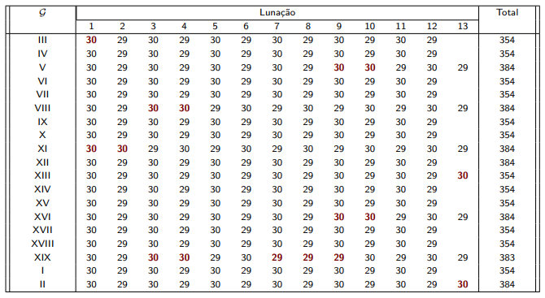
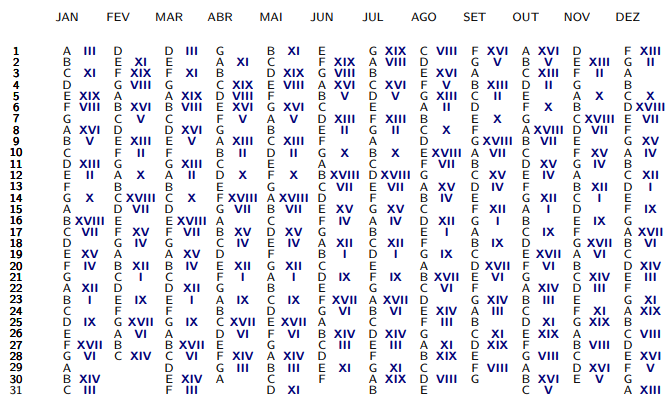
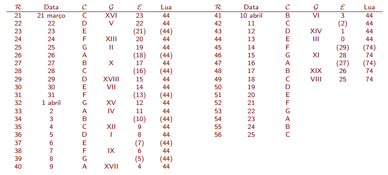

# Páscoa

[[toc]]

A `Páscoa` é celebrada no **primeiro** domingo após a 1ª Lua Cheia, a contar do equinócio da Primavera (que é **sempre** dia `21 de março`).  
Se a Lua Cheia calhar num domingo, a Páscoa será no domingo seguinte.

::: warning AVISO
Segundo o professor José Félix, a questão do teste sobre o calendário terá uma parte teórica, onde os alunos terão de mostrar que sabem mais do que apenas aplicar as fórmulas.
:::

## Ciclo de Méton

O `Ciclo de Méton`, descrito em cima, é um ciclo de **19 anos** que simula o verdadeiro comportamento da Lua. Um ano pode ter 12 ou 13 ciclos lunares.  
Cada mês/ciclo lunar começa e acaba com uma Lua Nova.

Algumas características do `Ciclo de Méton`:

- Meses embolísticos - meses adicionados para corrigir a aproximação (os meses **13**);
- _Saltus lunae_ - Um dia que é retirado ao ano **XIX**, ficando com 3 meses de 29 dias seguidos (também para corrigir a aproximação);
- O primeiro mês tem sempre **30** dias (mês onde o ciclo lunar começa em dezembro e acaba em janeiro);
- O mês Pascal tem sempre **29** dias;
- O ano **III** começa dia 1 de janeiro.

### Número de Ouro do Calendário

Para um dado ano $\lambda$, o seu respetivo ano do `Ciclo de Méton` é o `Número de Ouro`.  
Seja $G$ o `Número de Ouro` do ano $\lambda$,

$$G = 1 + \lambda\%19$$

::: details Lógica da Fórmula

- $G$ varia entre **1**-**19**;
- O ano 1 a.C. teve `Número de Ouro` **1**
  :::

---

## Matriz Lunar

Na `Matriz Lunar` estão representados os dias de cada ano do `Ciclo de Méton` que são Lua Nova.  
Por exemplo, 2 de fevereiro é Lua Nova no ano **XI** do `Ciclo de Méton`.

::: tip NOTA
As Luas Cheias são **13** dias depois das Luas Novas
:::

Com a `Matriz Lunar` conseguimos determinar as datas limite da Páscoa.

::: details Datas Limite da Páscoa

1. **Primerio Dia**

Será quando a Lua Cheia calha o mais cedo possível, a partir do início da Primavera.  
Vendo a `Matriz Lunar`, o `Número de Ouro` **XVI** tem uma Lua Nova dia `8 de março`, exatamente **13** dias antes do equinócio da Primavera.

Nos anos com `Número de Ouro` **XVI**, onde há Lua Cheia no equinócio, se esta calhar a um sábado, a Páscoa será logo no dia `22 de março`, a **primeira data possível para a Pásoca**.

2. **Último dia**

Será nos anos onde a Lua Cheia ocorre mesmo antes do dia do equinócio de Primavera.  
Olhando para a `Matriz Lunar`, conclui-se que será nos anos com `Número de Ouro` **VIII**, que têm uma Lua Cheia no dia `19 de março`.  
Recorrendo à tabela mais uma vez, repara-se que a Lua Cheia seguinte será dia `18 de abril` (já que há uma Lua Nova dia `5 de abril`).

Nestes anos, se a Lua Cheia calhar num domingo, a Páscoa será no domingo seguinte (+7 dias), ou seja, no dia `25 de abril`, a **última data possível para a Pásoca**.
:::

---

### Sequência dos Números de Ouro

Seja $G_n$ o n-ésimo `Número de Ouro` representado na `Matriz Lunar`,

$$
G_1 = 3\\
G_n = (G_{n-1}+8)\%19
$$

::: details Exemplos

1. n=2

$$
G_2 = (G_1+8)\%19\\
= (3+8) = 11 \checkmark
$$

:::

---

## Cálculo da Páscoa

### Epacta

Há quantos dias foi a última Lua Nova, relativamente ao dia `1 de janeiro`.

A `Epacta` é um número de **0**-**29**, que pode ser dado por:

$$
E = (8 +11(G -1))\% 30\\
G \rightarrow \text{número de ouro}
$$

::: details Lógica da Fórmula

- A `Epacta` pode ser vista como o "atraso" dos anos lunares, em relação aos anos solares (anos de 365 dias, anos bissextos serão contemplados depois);
- Aumenta 11 dias por ano (diferença entre ano solar e lunar);
- Anos com meses embolísticos ocorrem sempre quando os anos lunares estam atrasados $d \geq 30$ dias, em comparação com anos solares. Estes anos adicionam **30** dias ao calendário lunar, que diminuem o atraso (`Epacta`);  
  \*(Exemplo no fim)
- Epacta do `Número de Ouro` **I** é 8, onde já é aplicada a correção em relação ao _saltus lunae_ (ano **XIX** tem menos 1 dia que os restantes).

Logo,

$$E = (8 +11(G -1))\% 30$$

\*Exemplo:

Sabe-se que a `Epacta` do ano **III** é $0$, logo será $11$ e $22$ nos anos **IV** e **V**. Como o ano **V** é um ano com mês embolístico, a `Epacta`/**atraso face aos anos solares** do próximo ano vai ser menor (-30).

$$
E_{VI} = 11 + 11 + 11 - 30\\
=3
$$

Esta relação é mantida para todos os `Números de Ouro`.

:::

#### Teorema 1 - Simplificação da Fórmula

É possível calcular a `epacta` somente através de:

$$
E = (11G -3)\% 30
$$

::: details Demonstração

$$
E = (8 +11(G -1))\% 30\\
E=(8+11G-11)\% 30\\
E=(11G-3)\%30
$$

QED
:::

---

#### Teorema 2 - Unicidade da Epacta

Existe um **único** valor da `Epacta` para cada ano do `Ciclo de Méton`.

---

### Lua Cheia Pascal

O dia, **a partir de 21 de março**, da Lua Cheia que determina o domingo de Pásoca pode ser dado por:

$$
R = \begin{cases} 44 - E,\qquad E < 24 \\ 74-E,\qquad E \geq 24 \end{cases}
$$

Note-se que há casos onde $R>31$, e março tem **apenas** 31 dias. Isto acontece, pois os dias de abril são considerados dias de março, ou seja, 1 de abril é dia 32 de março e 10 de abril é dia 41 de março, por exemplo.

::: details Lógica da Fórmula

- Uma propriedade interessante é que a soma da `Epacta`, de um ano $\lambda$ ,com o dia do mês de março $(R)$ onde calha a `Lua Cheia Pascal`, contando os dias de abril como continuação do mês de março, é:
  - $44, \quad$ entre entre 21 e 44 de março (13 de abril)
  - $74, \quad$ entre 45 e 49 de março (18 de abril, última data possível para a Lua Cheia Pascal)

**NOTA:** As Luas Cheias são **13** dias depois da Lua Nova. Conseguimos obter todas as Luas Cheias, de cada `Número de Ouro`, através da [Tabela das Luas Novas](#matriz-lunar).

Desta forma, é simples chegar à fórmula apresentada.

:::

#### Teorema 3 - Simplificação da fórmula

$$
R = 20 + (54-E)\% 30\\
E \rightarrow \text{Epacta}
$$

::: details Demonstração

1. Se $E \geq 24$:

$$
R = 74 - E\\
=20 + 54 - E\\
= 20 + (54-E)\% 30
$$

2. Se $E < 24$:

$$
R = 44 - E\\
=20 + 24 - E\\
= 20 + (24-E)\% 30\\
= 20 + (54-E)\% 30
$$

:::

---

### Exemplo - Páscoa Juliana

::: details Exemplo

Calcular o dia da Páscoa para o ano `1901`.

1. **Número Dominical** ($N$)

$$
N = 7 - (1901 + 4  + (1901\div 4))\% 7\\
= 7 - (2380)\% 7 = 7
$$

1. [Número de Ouro](#numero-de-ouro-do-calendario) ($G$)

$$
G = 1 + (1901)\%19=1+1=2
$$

3. [Epacta](#epacta) ($E$)

$$
E = (11G-3)\%30 \\
= (11(2)-3)\%30 = 19
$$

1. Dia da [Lua Cheia Pascal](#teorema-3-simplificacao-da-formula) ($R$)

$$
R = 20 + (54 - E)\%30\\
= 20 +5 = 25
$$

1. **Número Calêndrico** da Lua Cheia Pascal ($C$)

$$
C = 1 + (R+2)\%7\\
= 1 + 6 = 7
$$

6. **Dia da Páscoa**

Como $N \leq C$,

$$
P = R + 7 - (C-N)\%7\\
=25 +7 -0 = 32
$$

Dia "`32 de março`", ou seja, dia `1 de abril`.

::: tip NOTA IMPORTANTE
Se $N>C$,

$$P= D + N - C$$

:::

---

::: warning AVISO

Ainda falta mencionar as exceções do `Calendário Gregoriano`.

:::
