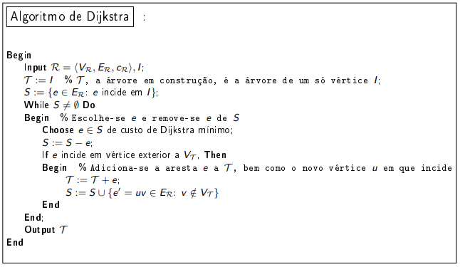

# Kruskal e Dijkstra

## Definições e Teoremas

### Árvore

Grafo conexo que não tem ciclos

::: details Exemplo

:::

### Teorema 1

Se $T$ é uma árvore de ordem $p$ e tamanho $q$, então

$$q = p-1$$

::: tip Relembrar

Ordem de um grafo $(p)$

- Número de vértices

Tamanho de um grafo $(q)$

- Número de arestas

:::

### Teorema 2

Um grafo $g$ de ordem $p$ é uma árvores, se e só se é conexo e tem tamanho $q=p-1$.

### Árvore de cobertura

Seja $g$ um grafo, $T$ é a sua `Árvore de Cobertura` se:

- É uma árvore
- É um subgrafo de $g$ que contém todos os vértices

::: details Exemplo

:::

### Custo de árvore

Dada uma `Rede` $(V,E,c)$, o custo de uma árvore de cobertura $T$ da `Rede` é o **somatório** de todos os valores das arestas de $T$.

::: tip Relembrar
`Rede` é um grafo com um valor real associado a cada aresta.
:::

::: details Exemplo

O custo da árvore representada é $21.1$

:::

### Árvore de cobertura mínima

Árvore de cobertura de uma Rede $R$, cujo [custo](#custo-de-arvore) é **menor ou igual** que o custo de qualquer outra Árvore de cobertura de $R$.

### Árvore Económica

Árvore de cobertura construída através do [Algoritmo de Kruskal](#algoritmo-de-kruskal).

## Algoritmos

### Algoritmo de Kruskal

::: details Pseudo-Código

:::

#### Descrição Informal

Assinalam-se sempre as arestas de custo mínimo, se **não** formarem ciclos. Caso forme um ciclo, a aresta é identificada e ignorada durante resto da execução do Algoritmo.  
O `Algoritmo de Kruskal` termina quando todas as arestas já foram analisadas. Tanto podem estar assinaladas ou identificadas como arestas que completam ciclos.  
O resultado final é uma [Árvore Económica](#arvore-economica), que também será uma Árvore de Custo mínimo.

::: tip NOTA

Por convenção, só se deve identificar arestas que formam ciclos, quando o valor dessa aresta for o mínimo das arestas ainda por analisar.

:::

::: details Exemplos:

[Exemplo 1](https://drive.google.com/file/d/1oZJCHj62aIndGWDfr7hDtphEoAo3VAzE/view?usp=sharing)  
[Exemplo 2](https://drive.google.com/file/d/1Vn6dirZylPZy4x81Q5-lnQtvHKqP2Wpd/view?usp=sharing)  
:::

Também se pode usar o `Algoritmos de Kruskal` para encontrar uma `árvore de cobertura máxima`, basta ir assinalando as arestas pela ordem inversa (1º as que têm valor máximo).

### Algoritmo de Dijkstra

Este Algoritmo resolve o Problema da Trajetória mínima.

::: details Pseudo-Código

:::

#### Descrição Informal

Seja $v_1$ o vértice de partida, $S$ o conjunto de arestas, ainda não percorridas, que **não** fazem ciclos e que incidem nos vértices já percorridos (vamos chamar ao conjunto de vértices já percorridos $Q$).  
Seja $\operatorname{F}(i)$ uma função que atribui a um vértice $v_i$, já percorrido, o custo necessário para lá chegar.

No início $Q=\{v_1\}$, por isso, escolhe-se a aresta que incide em $v_1$ com menor valor associado.  
Agora $\#Q>1$, por isso, em vez de escolhermos a aresta com menor valor disponível em $S$, escolhemos uma aresta que incida num novo vértice $v_k$, tal que ,**de todos os vértices ainda por explorar**, $\operatorname{F}(k)$ é o mínimo de todos os $\operatorname{F}(i)$ desse conjunto.  
O Algoritmo termina quando tivermos um custo associado a todos os vértices.

O resultado final será uma `Árvore de Cobertura`, onde para cada $v_i$, $\operatorname{F}(i)$ é o `custo mínimo possível`.

::: details Exemplos

[Exemplo 1](https://drive.google.com/file/d/1NqX_csh6u_Yagpr2GJe15PGhaM24tA1s/view?usp=sharing)  
[Exemplo 2](https://drive.google.com/file/d/1lE08JD2B-MQaauCKmA55K1ZfnLh-UU7z/view?usp=sharing)  
[Exemplo 3](https://drive.google.com/file/d/1Z05NeIE4AHG4kb6qV6miBkosfe8kflgG/view?usp=sharing)

:::
