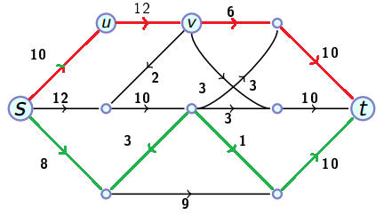
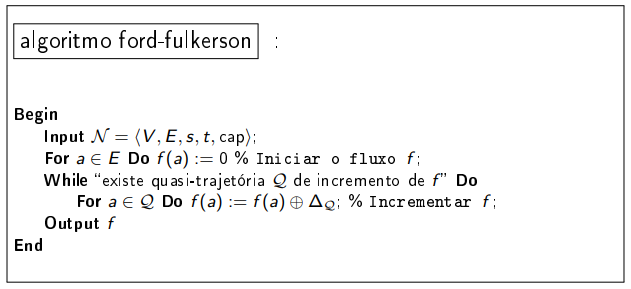

# Teoria do Fluxo

## Definições

### Digrafo

Grafo dirigido, todas as arestas têm orientação.

::: details Exemplo

:::

#### Grau de Entrada/Saída

Seja $v$ um vértice de um digrafo $d$:

- Grau de Entrada: Quantas arestas estão direcionadas para $v$
- Grau de Saída: Quantas arestas partem de $v$ para outro vértice

::: details Exemplo

Neste exemplo, o vértice **_v_** tem

- Grau de entrada $2$
- Grau de saída $2$

O vértice **_S_** tem

- Grau de entrada $0$
- Grau de saída $3$
  :::

#### Fonte e Semidouro

`Fonte` é o vértice de um digrafo conexo com grau de entrada nulo.  
`Semidouro` é o vértice de um digrafo conexo com grau de saída nulo.

::: tip Notação
Um digrafo-$s$-$t$ é um digrafo com `fonte` $s$
e `semidouro` $t$
:::

### Rede Capacitada

Uma rede capacitada $N=(V,E,s,t,\operatorname{cap})$ é um digrafo-$s$-$t$ $(V,E,s,t)$, com uma função capacidade $\operatorname{cap}: V \times V \rightarrow \N$, tal que, para vértices $v_i, v_k \in V$:

- $\operatorname{cap}(xy)=0$ se $xy \notin E$ (não é aresta do digrafo)
- $\operatorname{cap}(xy)\geq0$ se $xy \in E$

### Fluxo

Um Fluxo numa `Rede Capacitada` $N=(V,E,s,t,\operatorname{cap})$ é uma atribuição de valores $\operatorname{f}: V \times V \rightarrow \N$ às arestas do digrafo-$s$-$t$ $(V,E,s,t)$, onde:

- $\operatorname{f}(xy)=0$ se $xy \notin E$
- $\operatorname{f}(xy)\geq0$ se $xy \in E$
- $\operatorname{f}(xy) \leq \operatorname{cap}(xy)$ (Fluxo **não** pode exceder capacidade)
- Fluxo que entra num vértice $v$ é **igual** ao fluxo que sai de $v$

### Valor do Fluxo

O **Valor** de um Fluxo numa Rede Capacitada será igual ao somatório do fluxo que sai da `Fonte`, ou `Fontes` se houver mais do que uma.

::: details Dica

Podemos ver uma `Rede Capacitada`, como uma rede de calanização da água, onde há uma fonte, destino(semidouro) e as arestas são canos de água. Tal como na `Rede Capacitada`, um cano não tem água a circular nos dois sentidos, apenas num.  
Seguindo esta ideia,

- `Capacidade` $(\operatorname{cap})$ indica a quantidade máxima de água que cada cano aguenta.
- `Fluxo` $(\operatorname{f})$ indica a quantidade de água que está a passar em cada um dos canos
- O `Valor do Fluxo` é quantidade de água que emitimos na fonte.

:::

### Fluxo Máximo

Fluxo máximo é um fluxo $\operatorname{f}$, tal que o seu [valor](#valor-do-fluxo) é maior ou igual ao valor de qualquer outro fluxo na mesma `Rede capacitada`.

### Corte

Numa Rede $N=(V,E,s,t,\operatorname{cap})$, sejam $V_s$ e $V_t$ uma partição de $V$ $(V_s\cap V_t = \emptyset \quad \wedge \quad V_s\cup V_t =V)$, tal que $s \in V_s$ e $t \in V_t$.  
Ao conjunto de arestas orientadas de vértices em $V_s$ para vértices em $V_t$, ou dá-se o nome de `Corte` na rede $N$ e denota-se por $(V_s,V_t)$

### Capacidade do Corte

$$\operatorname{cap}(V_s,V_t) = \sum_{x \in V_s} \sum_{y \in V_t}\operatorname{cap}(xy)$$

Soma das **capacidades** de todas as arestas do corte.

::: details Exemplo

Neste Corte a {red}(vermelho) a capacidade do `Corte` será:

$$
6+3+10+9 = 28
$$

::: tip Nota
A aresta com capacidade $3$ mais abaixo não é incluída, porque vai de $V_t$ para $V_s$

:::

### Balanço de Fluxo

Balanço de fluxo, através de um corte $C = (V_s,V_t)$, que também pode ser identificado por **Fluxo do Corte $C$**, é a [capacidade do corte](#capacidade-do-corte) menos a soma dos fluxos das arestas orientadas de um vértice de $V_t$ para $V_s$ (fluxo negativo).  
Numa `Rede Capacitada`, para qualquer Corte, o `Balanço de Fluxo` é sempre o mesmo, ou seja, cada Corte tem o mesmo Fluxo.

::: details Exemplos

O `Balanço do Fluxo` deste corte será:

$$6+3+10+9 - 3=25$$

:::

### Corte mínimo

Corte, cuja [capacidade](#capacidade-do-corte) é menor ou igual à capacidade de qualquer outro corte da mesma Rede.

### Trajetória num Digrafo

Uma `trajetória` numa rede capacitada $N=(V,E,s,t,\operatorname{cap})$ é uma `trajetória aberta` de $s$ a $t$.

**Relembrar dos Grafos**: Trajetória aberta é um caminho que não repete vértices nem arestas, e que não é fechada (não acaba no mesmo vértice)

### Quasi-trajetória

[Trajetória](#trajetoria-num-digrafo), mas que pode ter arestas negativas. Seja

$$Q = s,a_1,v_1,a_2,\dots,v_{k-1},a_k,t$$

uma Quasi-trajetória, pode existir uma aresta $a_i$ (\*com $1<i<k$) que está dirigida de $v_i$ para $v_{i-1}$. Este tipo de arestas é designado por `arestas negativas`

::: tip NOTAS

- \*Não pode ser $1\leq i \leq k$, porque uma aresta da `fonte` sai sempre da fonte e uma do `semidouro` está sempre dirigida para este.
- É normal incluir-se uma [trajetória](#trajetoria-num-digrafo) no grupo das `Quasi-trajetórias`

:::

::: details Exemplos

Ambas respresentam `Quasi-Trajetórias`, mesmo que a {red}(vermelha) não tenho arestas negativas

:::

### Frouxidão

Seja $Q$ uma `Quasi-Trajetória` e $a$ uma aresta que faz parte de $Q$, a `Frouxidão` de $a$ é dada por:

$$
\Delta(a) = \begin{cases}
cap(a)-f(a) \\
f(a)
\end{cases}\\
$$

(Obrigado ao Rafael Oliveira)

A `Frouxidão` **mínima** de uma `Quasi-trajetória` $(\Delta_Q)$ será a mínima frouxidão de entre todas as arestas de $Q$.

### Incremento do Fluxo

Seja $Q$ uma `Quasi-Trajetória`, é possível incrementar o seu fluxo, se a `Frouxidão` mínima for **maior** que $0$.

Nesse caso, seja $(\Delta_Q)$ a `frouxidão mínima` de $Q$, adicionamos $(\Delta_Q)$ ao fluxo das arestas positivas, e retiramos $(\Delta_Q)$ do fluxo das arestas negativas

## Teoremas

### Teorema 1

O valor de um `fluxo` é menor ou igual à `capacidade` de um corte mínimo numa rede capacitada.  
Se o valor do fluxo $\operatorname{f}$ é igual à capacidade de um corte $(V_s,V_t)$, então o fluxo $\operatorname{f}$ é máximo e o corte $(V_s,V_t)$ é um [corte mínimo](#corte-minimo).

### Teorema 2

Um fluxo $\operatorname{f}$ numa Rede Capacitada $N$ é um fluxo máximo se e só se não
existir uma Quasi-trajetória de incremento do fluxo.

::: details Aviso do Professoor
Isto só se verifica numa `Rede Capacitada` com números **Racionais**. Há situações com números **Reais** onde não podemos concluir nada.  
Contudo, esta exceçãpo não deve ser avaliada
:::

## Algoritmo de Ford-Fulkerson

Numa Rede capacitada $N=(V,E,s,t,\operatorname{cap})$, permite-nos encontrar o `Fluxo` **máximo**.

::: details Pseudo-Código

:::

### Decrição Informal

Sempre que houver uma `Quasi-Trajetória` $Q$ com `Frouxidão mínima` **positiva**, aumentamos o fluxo de $Q$.  
Quando já não houver termina o algoritmo (pelo [Teorema 2](#teorema-2)), e teremos uma `Rede Capacitada` com [Fluxo máximo](#fluxo-maximo).

### Corte mínimo pelo Ford-Fulkerson

Seja $V_s$ o conjunto dos [vértices alcançáveis](#vertice-alcancavel) no final do [Algoritmo de Ford-Fulkerson](#algoritmo-de-ford-fulkerson) e $V_t$ tal que $V_s\cap V_t = \emptyset \quad \wedge \quad V_s\cup V_t =\{\text{conjunto de todos os vértices}\}$, $(V_s,V_t)$ é um `Corte Mínimo`, porque respeita as condições do [Teorema 1](#teorema-1).

::: tip NOTA
Podemos usar o [Teorama 1](#teorema-1) para verificar que o corte que escolhemos no final do [Algoritmo de Ford-Fulkerson](#algoritmo-de-ford-fulkerson) é mínimo ou não. Só se for mínimo é que a resposta está correta.
:::

#### Vértice alcançável

Um vértice $v$ é `alcançável` se é possível aumentar o fluxo de uma "pseudo" Quasi-trajetória que começa na `fonte` e vai até ao vértice $v$.

::: tip Atenção
Pode acontecer que uma aresta já tenha fluxo **=** capacidade, mas o vértice a que se dirige seja `alcançável`. Esses casos devem-se à existência de arestas negativas.
:::

::: details Exemplo do Ford-Fulkerson + Corte  
[Link](https://drive.google.com/file/d/1BXenki2yM_m5ESCLFu-k7GTXzVjaorj5/view?usp=sharing)
:::
