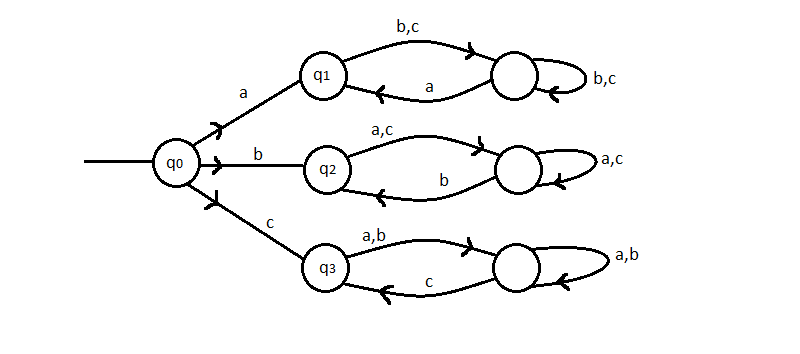

# Autómatos

::: details Pequeno Exemplo

Representação gráfica de um autómato que, numa palavra de $0$'s e $1$'s finita, verifica se o número de $0$'s é par e $1$'s é ímpar.

Onde $p$ é par, $i$ ímpar e primeiro referimo-nos aos $0$'s e depois aos $1$'s.  
"Ei" aponta para o estado inicial quando começa.

:::

## Definições

### Autómato Finito Determinístico (AFD)

Um autómato finito determinístico é um quíntuplo $D = (Q,\Sigma,\delta,q_0,F)$ onde:

- $Q$ é um conjunto finito não vazio
- $q_0$ é o estado inicial do autómato $(q_0 \in Q)$
- $\Sigma$ é um alfabeto (conj. finito de símbolos)
- $F$ estados de aceitação/finais $(F \subseteq Q)$
- $\delta$ função que, com o estado atual e com $\sigma \in \Sigma$ que recebe, transita para um novo estado $(\delta: Q \times \Sigma \rightarrow Q )$

::: details Exemplo 1

Pegando no exemplo do início onde queríamos verificar se, numa palavra de $0$'s e $1$'s, o número de $0$'s é par e $1$'s é ímpar.

$$
D = (Q,\Sigma,\delta,q_0,F)\\
Q = \{pp,pi,ip,ii\}\\
\Sigma = \{0,1\}\\
\begin{array}{c|c|c}
\delta & 0 & 1  \\
\hline
pp & ip & pi\\
\hline
pi & ii & pp \\
\hline
ip & pp  & ii \\
\hline
ii & pi & ip
\end{array}\\
q_0 = pp\\
F = \{pi\} \\
$$

Relembrar que queríamos ver se a palavra tinha um número par de $0$'s e ímpar de $1$'s, por isso é que $F = \{pi\}$.

:::

::: details Exemplo 2

Queremos verificar se uma palavra consituída por elementos de $\Sigma=\{x,y,z\}$ acaba em $yz$

$$
D = (Q,\Sigma,\delta,q_0,F)\\
Q = \{<Ei>,<y>,<yz>\}\\
\Sigma = \{x,y,z\}\\
\begin{array}{c|c|c|c}
\delta & x & y & z \\
\hline
<Ei> & <Ei> & <y> & <Ei> \\
\hline
<y> & <Ei> & <y> & <yz>\\
\hline
<yz> & <Ei>  & <y> & <Ei>
\end{array}\\
q_0 = <Ei> \\
F = \{<yz>\} \\
$$

::: warning Aviso

Apesar de ter usado **\<Ei\>** para representar o estado inicial, é costume usar <$\epsilon$>.

:::

::: details Exemplo 3

Queremos um AFD que receba palavras formadas por $\Sigma=\{a,b,c\}$ e que verifique se começa e acaba na mesma letra.  
Neste exemplo, mostra-se apenas a representação gráfica.

$F = \{q_1,q_2,q_3\}$

:::

::: tip IMPORTANTE

Podemos definir ainda $\delta^*$, como sendo a função que recebe um estado e uma palavra. Pode ser definida recursivamente como:

$$
\delta^*(q,wa) = \delta(\delta^*(q,w),a)\\
\forall q \in Q,\quad \forall a \in \Sigma,\quad \forall w \in \Sigma^* \\
\Sigma^* \rightarrow \text{conjunto das palavras formadas com } \Sigma
$$

:::

### Aceitação de um AFD

Diz-se que um [AFD](#aceitacao-de-um-afd) $D = (Q,\Sigma,\delta,q_0,F)$ **aceita** a palavra $w \in \Sigma^*$ se $\delta^*(q_0,w) \in F$ (O estado a que chegamos no final pertence aos estados de aceitação)

### Linguagem reconhecida

A Linguagem (ou conjunto) reconhecido (ou decidido) pelo [AFD](#aceitacao-de-um-afd) $D = (Q,\Sigma,\delta,q_0,F)$ é o conjunto $L(D) = \{w \in \Sigma^* : \delta^*(q_0,w) \in F\}$ (conjunto de palavras que o AFD aceita).

### Linguagem Regular

Uma Linguagem diz-se Regular se existir um AFD que a reconheça.
