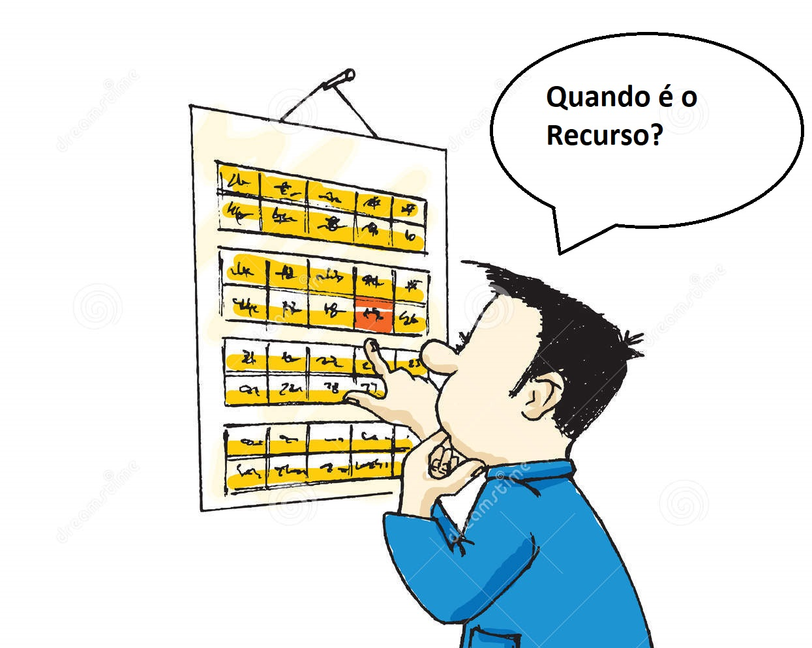

# Calendários (Cheat Sheet)

[[toc]]

::: warning
É possível que possa haver algum erro,\
se encontrarem avisem @pesteves no chat de MD para eu corrigir
:::

## Calendário

$$
\begin{array}{|c|c|c|}
\hline
Dia da Semana & Letra & Número
\\

\hline
 Domingo & A & 1 \\
\hline
 Segunda-Feira & B & 2 \\
\hline
 Terça-Feira & C & 3 \\
\hline
 Quarta-Feira & D & 4 \\
\hline
 Quinta-Feira & E & 5 \\
\hline
 Sexta-Feira & F & 6 \\
\hline
 Sábado & G & 7 \\
\hline
\end{array}
$$

$$

{
\begin{array}{|c|c|c|c|}
\hline
 JAN & A & JUL & G \\
\hline
 FEV & D & AGO & C \\
\hline
 MAR & D & SET & F \\
\hline
 ABR & G & OUT & A \\
\hline
 MAI & B & NOV & D \\
\hline
 JUN & E & DEZ & F \\
 \hline
\end{array}}
$$

Um ano é Bissexto se é divisível por 4 e não for divisível por 100,\
 a não ser que seja também divisível por 400.

## Calendário Gregoriano

### Dia do Mês

$\mathcal{D}$ = Dia Do Mês

$\mathcal{F}$ = Número do 1º Dia Do Mês

$\mathcal{Y}$ = Ano

$\mathcal{C} = 1 + (\mathcal{D}+ \mathcal{F} -2)$ % 7

$\mathcal{N} = 7 - (\mathcal{Y} - 1 +  \mathcal{Y} / 4 - \mathcal{Y} / 100 + \mathcal{Y} / 400)$ % 7

Se for Janeiro ou Fevereiro e é Ano Bisssexto:

$\mathcal{W} = 1 + (\mathcal{C} - \mathcal{N} + 6)$ % 7

Se não:

$\mathcal{W} = 1 + (\mathcal{C} - \mathcal{N} + 7)$ % 7

### Dia da Páscoa

${Y}$ = Ano

${G} = 1 + {Y}$ % 19

${E} = (57 + 11G - S + \lfloor{\frac {S} {4}}\rfloor + \lfloor{\frac {S - \lfloor{\frac {S - 17} {25}}\rfloor} {3}}\rfloor)$ % 30

${V} = (E / 24 - E / 25) + (G / 12) * (E / 25 - E / 26)$

${D} = 20 + (54 - {E}+ V)$ % 30

${C} = 1 + ({D} + 2)$ % 7

${N} = 7 - ({Y} - 1 +  {Y} / 4 - {Y} / 100 +  {Y} / 400 )$ % 7

Se ${C} < {N}$

${S} = {D} + {N} - {C}$

Se não

${S} = {D} + 7 - ({N} - {C})$ % 7

Dia da páscoa = dia 1 de março + S

## Calendário Juliano

### Dia do Mês

$\mathcal{D}$ = Dia Do Mês

$\mathcal{F}$ = Número do 1º Dia Do Mês

$\mathcal{Y}$ = Ano

$\mathcal{C} = 1 + (\mathcal{D}+ \mathcal{F} -2)$ % 7

$\mathcal{N} = 7 - (\mathcal{Y} + 4 + \mathcal{Y}$ / 4 $)$ % 7

Se for Janeiro ou Fevereiro e é Ano Bisssexto:

$\mathcal{W} = 1 + (\mathcal{C} - \mathcal{N} + 6)$ % 7

Se não:

$\mathcal{W} = 1 + (\mathcal{C} - \mathcal{N} + 7)$ % 7

### Dia da Páscoa

${Y}$ = Ano

${G} = 1 + {Y}$ % 19

${E} = (11 {G} - 3)$ % 30

${D} = 20 + (54 - {E})$ % 30

${C} = 1 + ({D} + 2)$ % 7

${N} = 7 - ({Y} - 4 + {Y} / 4)$ % 7

Se ${C} < {N}$

${S} = {D} + {N} - {C}$

Se não

${S} = {D} + 7 - ({N} - {C})$ % 7

Dia da páscoa = dia 1 de março + S

